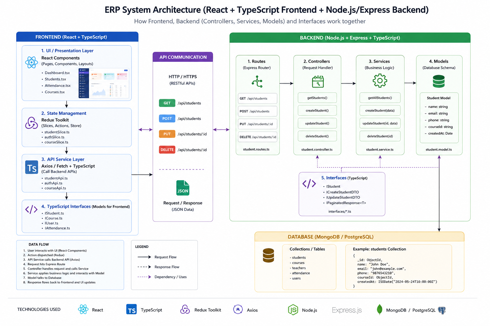
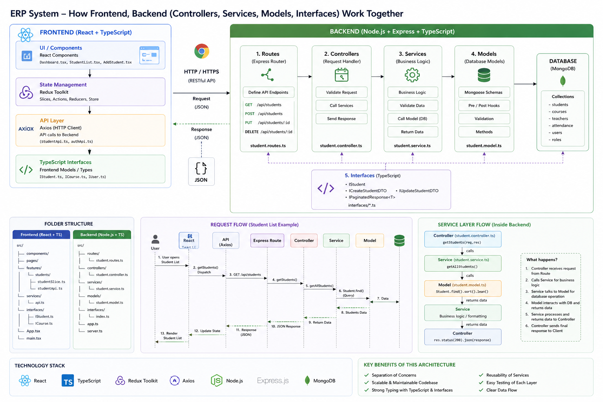
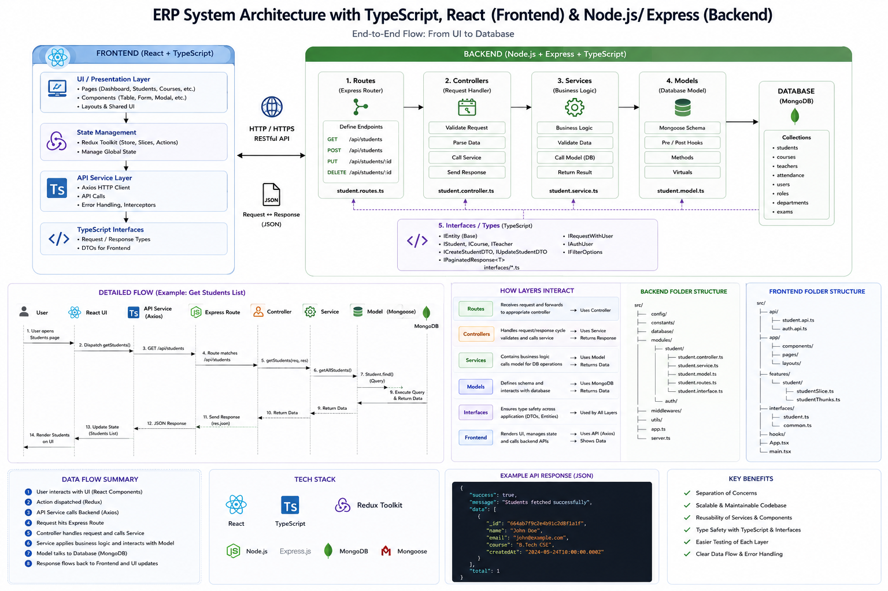

# College ERP System

A modern and scalable College ERP (Enterprise Resource Planning) System built using React, TypeScript, Node.js, Express, and MongoDB.  
This project follows a clean architecture pattern with Controllers, Services, Models, Interfaces, and API layers.

---

## Project Architecture

<p align="center">
  
</p>

<p align="center">
  
  
</p>


---

# Features

## Authentication Module
- JWT Authentication
- Role Based Access Control
- Secure Password Hashing
- Login & Logout System
- Refresh Token Handling

---

## Student Management
- Add Student
- Update Student
- Delete Student
- Student Profile Management
- Student Attendance
- Student Result Management

---

## Teacher Management
- Teacher Registration
- Teacher Dashboard
- Subject Assignment
- Attendance Tracking
- Salary Management

---

## Department Module
- Create Department
- Department Head Management
- Department Statistics
- Course Allocation

---

## Attendance System
- Daily Attendance
- Subject Wise Attendance
- Attendance Reports
- Monthly Analytics

---

## Examination Module
- Exam Scheduling
- Marks Entry
- Result Generation
- Grade Calculation

---

## Finance Module
- Fee Management
- Invoice Generation
- Payment Tracking
- Financial Reports

---

## Admin Dashboard
- Analytics Dashboard
- Charts & Reports
- User Management
- System Settings

---

# Tech Stack

## Frontend
- React
- TypeScript
- Redux Toolkit
- React Router
- Axios
- Tailwind CSS

---

## Backend
- Node.js
- Express.js
- TypeScript
- MongoDB
- Mongoose
- JWT Authentication
- bcrypt

---

# Folder Structure

## Frontend Structure

```bash
frontend/
│
├── src/
│   ├── api/
│   ├── components/
│   ├── pages/
│   ├── redux/
│   ├── hooks/
│   ├── layouts/
│   ├── interfaces/
│   ├── services/
│   └── utils/
```

---

## Backend Structure

```bash
backend/
│
├── src/
│   ├── controllers/
│   ├── services/
│   ├── routes/
│   ├── models/
│   ├── middlewares/
│   ├── interfaces/
│   ├── config/
│   ├── database/
│   └── utils/
```

---

# Backend Architecture Flow

```text
Client Request
      │
      ▼
Routes
      │
      ▼
Controllers
      │
      ▼
Services
      │
      ▼
Models
      │
      ▼
MongoDB Database
```

---

# Frontend Architecture Flow

```text
React Components
        │
        ▼
Redux State / Hooks
        │
        ▼
API Service Layer
        │
        ▼
Backend REST APIs
```

---

# API Example

## Get All Students

```http
GET /api/v1/students
```

## Create Student

```http
POST /api/v1/students
```

---

# Environment Variables

## Backend `.env`

```env
PORT=5000
MONGO_URI=your_mongodb_url
JWT_SECRET=your_secret_key
NODE_ENV=development
```

---

# Installation

## Clone Repository

```bash
git clone https://github.com/your-username/college-erp.git
```

---

## Install Frontend Dependencies

```bash
cd frontend
npm install
```

---

## Install Backend Dependencies

```bash
cd backend
npm install
```

---

# Run Project

## Frontend

```bash
npm run dev
```

## Backend

```bash
npm run dev
```

---

# Future Enhancements

- Real-time Notifications
- Video Classes
- AI Analytics
- Mobile Application
- Multi College Support
- Cloud Deployment

---

# Screenshots

<p align="center">
  
</p>

<p align="center">
  
</p>

<p align="center">
  
</p>

---

# Author

Malay Maity

---

# License

This project is licensed under the MIT License.
